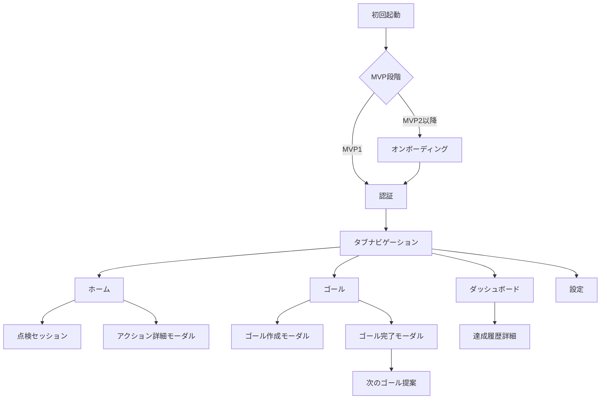

# 画面設計書 — パーソナルコーチング モバイルアプリ『Flow Finder』

## 1. デザインガイドライン

### 1.1 ブランドカラー

- **Primary**: `#FFC400` (イエロー) — 行動を促すアクセント・CTA ボタン
- **Secondary**: `#212121` (ブラック) — テキスト・アイコン
- **Neutral**: `#FFFFFF` (ホワイト) — 背景・カード
- **Success**: `#4CAF50` (グリーン) — 完了状態・ポジティブアクション
- **Warning**: `#FF9800` (オレンジ) — 注意・制限表示
- **Error**: `#F44336` (レッド) — エラー・削除アクション

### 1.2 タイポグラフィ

- **見出し**: システムフォント Bold, line-height 1.2
- **本文**: システムフォント Regular, line-height 1.5
- **キャプション**: システムフォント Medium, line-height 1.3

### 1.3 画面サイズ対応

- **基準画面**: iPhone 14 (390px × 844px)
- **最小対応**: iPhone SE (375px × 667px)
- **最大対応**: iPhone 14 Pro Max (430px × 932px)
- **Android**: 360dp × 640dp 以上

### 1.4 UI ライブラリ・スタイル

- **UI フレームワーク**: React Native + NativeWind
- **アイコン**: Expo Vector Icons (Feather)
- **アニメーション**: React Native Reanimated
- **参考トーン**: ミニマル・クリーン（Linear / Todoist 風）+ 温かみのあるイエロー
- **禁止スタイル**: 過度なグラデーション・影・ネオモーフィズム

## 2. アプリ構造 & ナビゲーション

### 2.1 ナビゲーション構造



**MVP 段階別フロー**:

- **MVP1 段目**: 初回起動 → 認証 → タブナビゲーション（オンボーディングスキップ）
- **MVP2 段目以降**: 初回起動 → オンボーディング → 認証 → タブナビゲーション

### 2.2 タブナビゲーション

| タブ               | アイコン    | ルート              | 画面名        |
| ------------------ | ----------- | ------------------- | ------------- |
| **ホーム**         | home        | `/(tabs)/`          | index.tsx     |
| **ゴール**         | target      | `/(tabs)/goals`     | goals.tsx     |
| **ダッシュボード** | bar-chart-2 | `/(tabs)/dashboard` | dashboard.tsx |
| **設定**           | settings    | `/(tabs)/settings`  | settings.tsx  |

## 3. 画面設計詳細

### 3.1 オンボーディング `/onboarding` (MVP2 段目実装)

**目的**: アプリの価値提案・機能説明・プラン説明（MVP2 段目で実装）

#### 画面 1: アプリ紹介

```
┌─────────────────────────────────────┐
│           🎯 Flow Finder            │
│                                     │
│      あなたの成長を妨げる           │
│      「見えない壁」を見つけて       │
│         一緒に壊しませんか？        │
│                                     │
│ Flow Finderができること              │
│ ┌─────────────────────────────────┐ │
│ │ 🎯 ゴール設定 - 目標を明確にする │ │
│ │ 🔍 壁の発見 - なぜ進まないかを特定│ │
│ │ 💡 解決策提案 - 具体的なアクション│ │
│ └─────────────────────────────────┘ │
│                                     │
│               ● ○ ○ ○              │
│ ┌─────────────────────────────────┐ │
│ │           次へ                  │ │
│ └─────────────────────────────────┘ │
│               スキップ               │
└─────────────────────────────────────┘
```

#### 画面 2: ゴール設定の価値

```
┌─────────────────────────────────────┐
│        なぜゴール設定が重要？        │
│                                     │
│      明確な目標があることで         │
│       進むべき方向が見えてきます     │
│                                     │
│ ❌ 目標が曖昧だと...               │
│ ┌─────────────────────────────────┐ │
│ │ • 何から始めればいいかわからない  │ │
│ │ • 進捗がわからず挫折しやすい     │ │
│ │ • 達成感を感じにくい            │ │
│ └─────────────────────────────────┘ │
│                                     │
│ ✅ 明確な目標があると...            │
│ ┌─────────────────────────────────┐ │
│ │ • 何をすべきか明確になる        │ │
│ │ • 進捗を実感できる              │ │
│ │ • 達成感とモチベーション向上     │ │
│ └─────────────────────────────────┘ │
│                                     │
│               ○ ● ○ ○              │
│     [戻る]           [次へ]        │
│               スキップ               │
└─────────────────────────────────────┘
```

#### 画面 3: 点検セッション紹介

```
┌─────────────────────────────────────┐
│         5ステップで壁を発見          │
│                                     │
│      進まない理由を見つけて         │
│     具体的な解決策を考えましょう     │
│                                     │
│ ┌─────────────────────────────────┐ │
│ │ 1⃣ 現状特定 - 何が進んでいないか │ │
│ │ 2⃣ 原因分析 - なぜ進まないのか   │ │
│ │ 3⃣ 解決策 - どうすれば良いか     │ │
│ │ 4⃣ 計画立案 - いつ、どのように   │ │
│ │ 5⃣ アクション - 具体的な行動計画 │ │
│ └─────────────────────────────────┘ │
│                                     │
│               ○ ○ ● ○              │
│     [戻る]           [次へ]        │
│               スキップ               │
└─────────────────────────────────────┘
```

#### 画面 4: プラン説明

```
┌─────────────────────────────────────┐
│         あなたに合ったプラン         │
│                                     │
│       まずは無料で始めて           │
│      必要に応じてアップグレード      │
│                                     │
│ ⚡ 無料プラン            ¥0        │
│ ┌─────────────────────────────────┐ │
│ │ ✓ ゴール登録 1件                │ │
│ │ ✓ 点検セッション 月2回          │ │
│ │ ✓ 履歴閲覧 直近3回分            │ │
│ └─────────────────────────────────┘ │
│                                     │
│ 💎 Premium             ¥600/月    │
│ ┌─────────────────────────────────┐ │
│ │ ✓ 無制限ゴール登録              │ │
│ │ ✓ 無制限点検セッション          │ │
│ │ ✓ 全期間履歴閲覧               │ │
│ │ ⏳ AI提案機能（近日追加）       │ │
│ └─────────────────────────────────┘ │
│                                     │
│               ○ ○ ○ ●              │
│ ┌─────────────────────────────────┐ │
│ │         無料で始める            │ │
│ └─────────────────────────────────┘ │
│     [戻る]      [Premium を見る]   │
└─────────────────────────────────────┘
```

**実装タイミング**: MVP2 段目（Week 4.5 - Week 5）

**コンポーネント**:

- `OnboardingSlider`: 4 画面のスライダー
- `AppIntroSlide`: アプリ紹介画面
- `GoalValueSlide`: ゴール設定価値説明画面
- `SessionIntroSlide`: 点検セッション紹介画面
- `PlanComparisonSlide`: プラン比較画面
- `PageIndicator`: 進捗インジケーター
- `GetStartedButton`: CTA ボタン
- `SkipButton`: スキップボタン

### 3.2 認証画面 `/auth/login`

**目的**: Supabase Auth でのユーザー認証

```
┌─────────────────────────────────────┐
│                                     │
│               ログイン               │
│                                     │
│ Email                               │
│ ┌─────────────────────────────────┐ │
│ │ example@email.com               │ │
│ └─────────────────────────────────┘ │
│                                     │
│ パスワード                           │
│ ┌─────────────────────────────────┐ │
│ │ ••••••••••••                    │ │
│ └─────────────────────────────────┘ │
│                                     │
│ ┌─────────────────────────────────┐ │
│ │           ログイン               │ │
│ └─────────────────────────────────┘ │
│                                     │
│ ┌─────────────────────────────────┐ │
│ │          新規登録               │ │
│ │       (Outline Button)          │ │
│ └─────────────────────────────────┘ │
│                                     │
│          パスワードをお忘れですか？  │
│                                     │
└─────────────────────────────────────┘
```

**コンポーネント**:

- `LoginForm`: React Hook Form + Zod
- `SignUpForm`: 新規登録フォーム
- `ForgotPasswordLink`: パスワードリセット

### 3.3 ホーム `/(tabs)/`

**目的**: 今日のゴール・アクションを一覧表示

```
┌─────────────────────────────────────┐
│ 👋 おはよう、田中さん               │
│                                     │
│ 🎯 今日のゴール                     │
│ ┌─────────────────────────────────┐ │
│ │ 💼 英語学習マスター               │ │
│ │ 優先度: 高                      │ │
│ │ ━━━━━━━━━━░░░░░░░░░░ 60%        │ │
│ └─────────────────────────────────┘ │
│                                     │
│ ✅ 今日のアクション                 │
│ ┌─────────────────────────────────┐ │
│ │ ☐ 朝の通勤時間に英語ポッドキャスト │ │
│ │   15分                          │ │
│ └─────────────────────────────────┘ │
│ ┌─────────────────────────────────┐ │
│ │ ✓ 昼休みに英単語アプリ5問        │ │
│ │   10分 (完了済み)               │ │
│ └─────────────────────────────────┘ │
│                                     │
│ 📊 今週の進捗                       │
│ ┌─────────────────────────────────┐ │
│ │ 完了アクション: 5/8              │ │
│ │ ████████░░░░░░░░░░ 62%           │ │
│ └─────────────────────────────────┘ │
│                                     │
│ ┌─────────────────────────────────┐ │
│ │        + 点検セッション開始      │ │
│ │      (Primary Button)           │ │
│ └─────────────────────────────────┘ │
└─────────────────────────────────────┘
```

**コンポーネント**:

- `WelcomeHeader`: ユーザー名表示
- `TodayGoalCard`: 今日のゴールカード
- `ActionList`: アクション一覧
- `WeeklyProgress`: 週間進捗バー
- `StartSessionButton`: セッション開始ボタン
- ゴールリスト表示・完了ボタンは共通 GoalList/GoalCard コンポーネントを利用

#### ホーム画面 `/`

- 「未達成のゴール」見出しの右側に『＋ ゴール作成』ボタンを設置。
- このボタンはゴール管理画面の切り替えボタン（py-2 px-3 rounded-lg text-sm text-center font-semibold）と同じ大きさ・デザイン。
- ゴール管理画面には追加しない。

### 3.4 点検セッション `/session/[step]`

**目的**: 5 ステップウィザードでボトルネック発見

#### Step 1: 現状の特定

```
┌─────────────────────────────────────┐
│ Step 1/5                            │
│ ████████░░░░░░░░░░░░░░░░░░░░░░░░░░░░░ │
│                                     │
│         現状を特定しましょう         │
│                                     │
│ 今、最も進んでいないことは何ですか？ │
│                                     │
│ 🎯 関連するゴール:                  │
│ ┌─────────────────────────────────┐ │
│ │ 英語学習マスター            ▼ │ │
│ └─────────────────────────────────┘ │
│                                     │
│ 💭 どんなことでも構いません:        │
│ ┌─────────────────────────────────┐ │
│ │ 資格試験の勉強が全然進まない... │ │
│ │                               │ │
│ │                               │ │
│ └─────────────────────────────────┘ │
│ 80/200文字                          │
│                                     │
│           [戻る]         [次へ] │
└─────────────────────────────────────┘
```

#### Step 4: 小さな一歩の決定（無料プラン）

```
┌─────────────────────────────────────┐
│ Step 4/5                            │
│ ████████████████████████████████░░░░░ │
│                                     │
│       小さな一歩を決めましょう       │
│                                     │
│ 🎯 あなたの状況に最適なヒント:      │
│ ┌─────────────────────────────────┐ │
│ │ 📅 時間管理                     │ │
│ │  ✨ 朝の15分だけ取り組む        │ │
│ │  ✨ 通勤時間を活用する          │ │
│ │  ✨ 昼休みの5分だけ勉強する     │ │
│ └─────────────────────────────────┘ │
│                                     │
│ 💭 あなたの小さな一歩:              │
│ ┌─────────────────────────────────┐ │
│ │ 朝の通勤時間15分だけ英語アプリ  │ │
│ │ を開く                          │ │
│ └─────────────────────────────────┘ │
│                                     │
│ ⏰ 所要時間: [5分] [15分] [30分]   │
│                                     │
│ 🔒 AI提案機能はPremiumで利用可能    │
│                                     │
│           [戻る]         [次へ] │
└─────────────────────────────────────┘
```

**コンポーネント**:

- `StepIndicator`: 進捗表示
- `SessionForm`: 各ステップのフォーム
- `HintDisplay`: ヒント表示（無料プラン用）
- `AISuggestions`: AI 提案（Premium 用）

### 3.5 ゴール管理 `/(tabs)/goals`

**目的**: ゴールの CRUD・優先度管理・達成履歴確認・完了マーク付与

```
┌─────────────────────────────────────┐
│ ゴール管理                 [+ 追加] │
│                                     │
│ 📋 現在のゴール                      │
│ ┌─────────────────────────────────┐ │
│ │ 💼 英語学習マスター               │ │
│ │ 優先度: 高 📊 60%              │ │
│ │                            [⋮] │ │
│ └─────────────────────────────────┘ │
│                                     │
│ ┌─────────────────────────────────┐ │
│ │ 🏃 健康的な生活習慣               │ │
│ │ 優先度: 中 📊 30%              │ │
│ │                            [⋮] │ │
│ └─────────────────────────────────┘ │
│                                     │
│ 🏆 達成済みゴール        [すべて表示] │
│ ┌─────────────────────────────────┐ │
│ │ ✅ 資格試験合格 2024/03/15       │ │
│ │ 期間: 74日 💪 ボトルネック5個解消│ │
│ │                            [>] │ │
│ └─────────────────────────────────┘ │
│                                     │
│ ┌─────────────────────────────────┐ │
│ │ ✅ 副業収入月5万円 2024/02/28    │ │
│ │ 期間: 120日 🚀 ボトルネック8個解消│ │
│ │                            [>] │ │
│ └─────────────────────────────────┘ │
│                                     │
│ 💡 Tip: 長押しで並び替えができます  │
└─────────────────────────────────────┘
```

**コンポーネント**:

- `ActiveGoalsList`: 現在のゴール一覧（ドラッグ&ドロップ対応）
- `GoalCard`: 個別ゴールカード
- `AddGoalButton`: 新規追加ボタン
- `GoalOptionsMenu`: 編集・削除・完了メニュー
- `AchievedGoalsList`: 達成済みゴール一覧
- `AchievementCard`: 達成履歴カード

### 3.6 ゴール完了画面 `/modal/goal-completion`

**目的**: ゴール達成時の祝福・振り返り・次のゴール提案（MVP 1 で達成マーク・完了リスト表示まで実装）

```
┌─────────────────────────────────────┐
│              🎉 おめでとう！         │
│                                     │
│      「英語学習マスター」達成！      │
│                                     │
│ ┌─────────────────────────────────┐ │
│ │  開始日: 2024/01/01              │ │
│ │  達成日: 2024/03/15              │ │
│ │  期間: 74日間                   │ │
│ │  解決したボトルネック: 5個       │ │
│ │  完了アクション: 42個            │ │
│ └─────────────────────────────────┘ │
│                                     │
│ 💭 振り返り（任意）                 │
│ ┌─────────────────────────────────┐ │
│ │ このゴールで学んだことや         │ │
│ │ 次に活かせる経験を記録...       │ │
│ │                               │ │
│ └─────────────────────────────────┘ │
│                                     │
│ 評価                                │
│ 難しさ: ⭐⭐⭐⭐⭐                 │
│ 満足度: ⭐⭐⭐⭐⭐                 │
│                                     │
│ ┌─────────────────────────────────┐ │
│ │         成果をシェア            │ │
│ └─────────────────────────────────┘ │
│                                     │
│ ┌─────────────────────────────────┐ │
│ │       次のゴールを設定          │ │
│ │      (Primary Button)           │ │
│ └─────────────────────────────────┘ │
│                                     │
│              [後で設定]              │
└─────────────────────────────────────┘
```

#### 次のゴール提案画面（Premium）

```
┌─────────────────────────────────────┐
│          🤖 AI からの提案            │
│                                     │
│ あなたの成長パターンを分析した結果、 │
│ 以下のゴールをおすすめします：       │
│                                     │
│ ┌─────────────────────────────────┐ │
│ │ 💼 プレゼンテーション スキル向上  │ │
│ │ 理由: 英語力を活用できる新領域   │ │
│ │                            [+] │ │
│ └─────────────────────────────────┘ │
│                                     │
│ ┌─────────────────────────────────┐ │
│ │ 📚 資格取得（TOEIC 900点）       │ │
│ │ 理由: 英語学習の継続で更なる高み │ │
│ │                            [+] │ │
│ └─────────────────────────────────┘ │
│                                     │
│ ┌─────────────────────────────────┐ │
│ │ 🌐 海外ボランティア参加          │ │
│ │ 理由: 実践的な英語活用の場       │ │
│ │                            [+] │ │
│ └─────────────────────────────────┘ │
│                                     │
│ ┌─────────────────────────────────┐ │
│ │       自分でゴールを作成        │ │
│ │       (Outline Button)          │ │
│ └─────────────────────────────────┘ │
└─────────────────────────────────────┘
```

**コンポーネント**:

- `GoalCompletionHeader`: 達成演出とサマリー表示
- `ReflectionForm`: 振り返り入力フォーム
- `RatingStars`: 難しさ・満足度評価
- `ShareButton`: SNS シェア機能
- `NextGoalSuggestions`: AI 提案（Premium 限定）
- `CreateNewGoalButton`: 次のゴール設定ボタン

### 3.7 ダッシュボード `/(tabs)/dashboard`

**目的**: 進捗可視化・履歴確認・成長トラッキング

```
┌─────────────────────────────────────┐
│ ダッシュボード                       │
│                                     │
│ 🏆 成長レベル: ボトルネック探偵 Lv.3 │
│ ┌─────────────────────────────────┐ │
│ │ 達成ゴール: 3個 | 次のレベルまで2個│ │
│ │ ████████████░░░░░░░░░░ 60%       │ │
│ └─────────────────────────────────┘ │
│                                     │
│ 📈 今週の成果                       │
│ ┌─────────────────────────────────┐ │
│ │ 完了アクション    [5個]          │ │
│ │ 点検セッション    [2回]          │ │
│ │ ボトルネック解消  [3個]          │ │
│ └─────────────────────────────────┘ │
│                                     │
│ 📊 月間達成率推移                   │
│ ┌─────────────────────────────────┐ │
│ │     ^                           │ │
│ │ 80% ┤ ●─●─●                     │ │
│ │ 60% ┤   ●   ●─●                 │ │
│ │ 40% ┤         ●                 │ │
│ │ 20% ┤                           │ │
│ │  0% └─┬─┬─┬─┬─┬─┬─┬            │ │
│ │      1  2  3  4  週             │ │
│ └─────────────────────────────────┘ │
│                                     │
│ 🏆 達成したゴール       [すべて表示] │
│ ┌─────────────────────────────────┐ │
│ │ ✅ 英語学習マスター 2024/03/15   │ │
│ │ 期間: 74日 🚀 満足度★★★★★       │ │
│ └─────────────────────────────────┘ │
│ ┌─────────────────────────────────┐ │
│ │ ✅ 副業収入月5万円 2024/02/28    │ │
│ │ 期間: 120日 💪 満足度★★★★☆      │ │
│ └─────────────────────────────────┘ │
│                                     │
│ 📝 最近のアクション達成              │
│ ┌─────────────────────────────────┐ │
│ │ ✓ 朝の英語学習 3日連続達成       │ │
│ │   2024/01/15                    │ │
│ └─────────────────────────────────┘ │
└─────────────────────────────────────┘
```

**コンポーネント**:

- `GrowthLevelCard`: 成長レベル・称号表示
- `WeeklyStats`: 週間統計カード
- `ProgressChart`: 達成率推移グラフ
- `CompletedGoalsList`: 達成済みゴール一覧
- `AchievementList`: 最近のアクション達成一覧
- `HistoryTimeline`: 履歴タイムライン

### 3.7 設定 `/(tabs)/settings`

**目的**: プロフィール・通知・課金管理

```
┌─────────────────────────────────────┐
│ 設定                                │
│                                     │
│ 👤 プロフィール                      │
│ ┌─────────────────────────────────┐ │
│ │ 田中太郎                        │ │
│ │ example@email.com               │ │
│ │                            [>] │ │
│ └─────────────────────────────────┘ │
│                                     │
│ 🔔 通知設定                         │
│ ┌─────────────────────────────────┐ │
│ │ 週次リマインダー           [●] │ │
│ │ アクション完了通知         [○] │ │
│ │                            [>] │ │
│ └─────────────────────────────────┘ │
│                                     │
│ 💎 プラン管理                       │
│ ┌─────────────────────────────────┐ │
│ │ 現在のプラン: Free              │ │
│ │ Premium にアップグレード         │ │
│ │ ✨ AI提案・無制限セッション     │ │
│ │                            [>] │ │
│ └─────────────────────────────────┘ │
│                                     │
│ ℹ️ サポート                         │
│ ┌─────────────────────────────────┐ │
│ │ ヘルプ & FAQ               [>] │ │
│ │ お問い合わせ               [>] │ │
│ │ プライバシーポリシー       [>] │ │
│ └─────────────────────────────────┘ │
│                                     │
│           ログアウト                │
└─────────────────────────────────────┘
```

**コンポーネント**:

- `ProfileCard`: プロフィール表示
- `NotificationSettings`: 通知設定
- `PlanCard`: プラン管理（Premium 誘導）
- `SupportLinks`: ヘルプ・サポートリンク
- `LogoutButton`: ログアウトボタン

## 4. モーダル・オーバーレイ

### 4.1 ゴール作成モーダル `/modal/goal-create`

```
┌─────────────────────────────────────┐
│              新しいゴール            │
│                                     │
│ タイトル                            │
│ ┌─────────────────────────────────┐ │
│ │ 例: 英語学習マスター            │ │
│ └─────────────────────────────────┘ │
│                                     │
│ カテゴリ                            │
│ ┌─────────────────────────────────┐ │
│ │ 📚 学習・スキルアップ          ▼ │ │
│ └─────────────────────────────────┘ │
│                                     │
│ 優先度                              │
│ ┌───┐ ┌───┐ ┌───┐              │
│ │ 高 │ │ 中 │ │ 低 │              │
│ └─●─┘ └───┘ └───┘              │
│                                     │
│ 説明（任意）                        │
│ ┌─────────────────────────────────┐ │
│ │ このゴールについて詳しく...     │ │
│ │                               │ │
│ └─────────────────────────────────┘ │
│                                     │
│    [キャンセル]        [作成]    │
└─────────────────────────────────────┘
```

### 4.2 Premium アップグレードモーダル

```
┌─────────────────────────────────────┐
│                Premium               │
│                                     │
│ ✨ すべての機能を無制限で利用       │
│                                     │
│ ┌─────────────────────────────────┐ │
│ │ ✓ 無制限ゴール登録              │ │
│ │ ✓ 無制限点検セッション          │ │
│ │ ✓ AI による小さな一歩提案       │ │
│ │ ✓ 全期間履歴閲覧               │ │
│ │ ✓ CSV エクスポート              │ │
│ │ ✓ 詳細分析ダッシュボード        │ │
│ └─────────────────────────────────┘ │
│                                     │
│              ¥600 / 月              │
│                                     │
│ ┌─────────────────────────────────┐ │
│ │         今すぐ始める            │ │
│ │      (Primary Button)           │ │
│ └─────────────────────────────────┘ │
│                                     │
│ 💡 7日間無料トライアル              │
│    いつでもキャンセル可能           │
│                                     │
│              [閉じる]               │
└─────────────────────────────────────┘
```

## 5. インタラクション・アニメーション

### 5.1 基本アニメーション

- **画面遷移**: フェードイン・スライド（200ms）
- **ボタンタップ**: スケール（0.95x, 100ms）
- **リスト項目**: スワイプ削除・並び替え
- **進捗バー**: 数値変化時のアニメーション（500ms）

### 5.2 フィードバック

- **ハプティック**: 重要なアクション時（完了・削除など）
- **Toast**: 操作完了・エラー通知
- **Pull to Refresh**: データ更新
- **ローディング**: スケルトン・スピナー

## 6. アクセシビリティ

### 6.1 VoiceOver / TalkBack 対応

- 全てのボタン・リンクに `accessibilityLabel`
- フォーム要素に `accessibilityHint`
- 画像に `accessibilityRole="image"`

### 6.2 その他の配慮

- **色覚多様性**: カラーのみに依存しない情報伝達
- **文字サイズ**: システム設定に対応
- **コントラスト比**: WCAG AA 準拠（4.5:1 以上）

## 7. デザインシステム

### 7.1 コンポーネント一覧

| カテゴリ   | コンポーネント                               | 使用箇所               |
| ---------- | -------------------------------------------- | ---------------------- |
| **基本**   | Button, Input, Card, Modal                   | 全画面                 |
| **表示**   | ProgressBar, Badge, Avatar                   | ホーム・ダッシュボード |
| **入力**   | TextArea, Picker, Toggle                     | フォーム・設定         |
| **ナビ**   | TabBar, Header, BackButton                   | ナビゲーション         |
| **リスト** | GoalList, GoalCard（ホーム・ゴール管理共通） | ホーム・ゴール管理     |

### 7.2 スペーシング

- **Base Unit**: 4px
- **Small**: 8px (2units)
- **Medium**: 16px (4units)
- **Large**: 24px (6units)
- **XLarge**: 32px (8units)

---

> 本設計書は 2025-01-01 時点のモバイル UI 方針を示します。変更は Figma & GitHub Issue に記録し、デザインシステムと同期してください。
