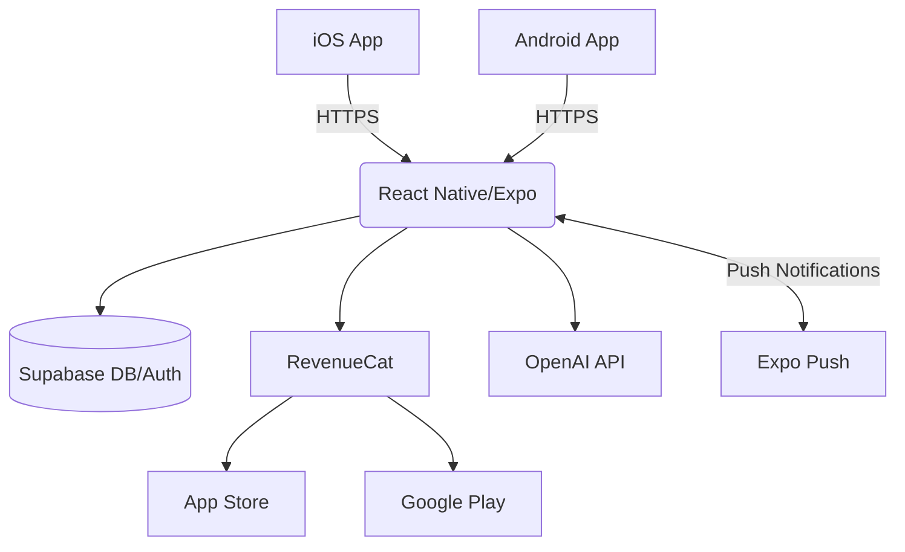

# アプリ構造定義書 — パーソナルコーチング モバイルアプリ『Flow Finder』

このドキュメントは MVP 開発前の **アプリ全体構造** を明確化し、開発/デザインチームが共通認識を持つことを目的とします。ディレクトリ設計・画面/API 仕様・DB スキーマ・外部連携などを包括的に記載します。

## 1. システム概要

- **形式**: React Native モバイルアプリ (Expo SDK + TypeScript)
- **目的**: ユーザーの "見えないボトルネック" を可視化し、行動を促進するコーチング体験を提供
- **対象ユーザー**: 成長意欲の高い 20〜40 代のビジネスパーソン / 学生
- **対象プラットフォーム**: iOS・Android（クロスプラットフォーム対応）

## 2. 全体アーキテクチャ図



## 3. ディレクトリレイアウト

```text
/app                          # Expo Router (App Router)
  _layout.tsx                 # ルートレイアウト
  (tabs)/                     # タブナビゲーション
    _layout.tsx               # タブレイアウト
    index.tsx                 # ホーム画面
    goals.tsx                 # ゴール管理
    dashboard.tsx             # ダッシュボード
    settings.tsx              # 設定画面
  session/                    # 点検セッション
    _layout.tsx
    [step].tsx                # 5ステップウィザード
  onboarding/                 # オンボーディング
    _layout.tsx
    index.tsx
  modal/                      # モーダル画面
    goal-create.tsx           # ゴール作成
    action-detail.tsx         # アクション詳細
  auth/                       # 認証関連
    login.tsx
    register.tsx
/components                   # 再利用可能コンポーネント
  ui/                         # 基本UIコンポーネント
    Button.tsx
    Input.tsx
    Card.tsx
    Modal.tsx
    ProgressBar.tsx
  forms/                      # フォーム関連
    GoalForm.tsx
    SessionForm.tsx
  charts/                     # グラフ・可視化
    ProgressChart.tsx
    HistoryChart.tsx
  features/                   # 機能別コンポーネント
    session/
      SessionWizard.tsx
      StepIndicator.tsx
    goals/
      GoalList.tsx
      GoalCard.tsx
    dashboard/
      StatsCard.tsx
      RecentActivity.tsx
  layout/                     # レイアウト関連
    AppHeader.tsx
    TabNavigation.tsx
/lib                          # ライブラリ・ユーティリティ
  supabase.ts                 # Supabase クライアント
  store/                      # 将来の状態管理ライブラリ用（Phase 2以降）
    auth.ts                   # (将来) Zustand ストア
    goals.ts                  # (将来) Zustand ストア
    session.ts                # (将来) Zustand ストア
  api/                        # API クライアント
    goals.ts
    sessions.ts
    actions.ts
  utils.ts                    # ユーティリティ関数
  constants.ts                # 定数
/hooks                        # カスタムフック
  useAuth.ts
  useGoals.ts
  useSession.ts
/types                        # TypeScript型定義
  goal.types.ts
  session.types.ts
  user.types.ts
/constants                    # 定数
  Colors.ts
  Layout.ts
/assets                       # 画像・フォントなど
  images/
  fonts/
/scripts                      # DB マイグレーション / Seed
  setup-db.ts
```

## 4. 画面遷移 & ナビゲーション仕様

| 画面                       | ルート                 | アクセス制御   | 主なコンポーネント                       |
| -------------------------- | ---------------------- | -------------- | ---------------------------------------- |
| **オンボーディング**       | `/onboarding`          | 初回起動時     | `OnboardingSlider`, `GetStartedButton`   |
| **認証**                   | `/auth/login`          | Public         | `LoginForm`, `SignUpForm`                |
| **ホーム**                 | `/(tabs)/`             | **要ログイン** | `GoalCard`, `ActionList`, `ProgressBar`  |
| **点検セッション**         | `/session/[1-5]`       | **要ログイン** | `SessionWizard`, `StepIndicator`         |
| **ゴール管理**             | `/(tabs)/goals`        | **要ログイン** | `GoalList`, `GoalForm`, `PriorityPicker` |
| **ダッシュボード**         | `/(tabs)/dashboard`    | **要ログイン** | `ProgressChart`, `HistoryChart`          |
| **設定**                   | `/(tabs)/settings`     | **要ログイン** | `ProfileForm`, `NotificationToggle`      |
| **ゴール作成モーダル**     | `/modal/goal-create`   | **要ログイン** | `GoalForm`, `CategoryPicker`             |
| **アクション詳細モーダル** | `/modal/action-detail` | **要ログイン** | `ActionDetail`, `CompletionButton`       |

## 5. データ層設計

### 5.1 Supabase API

React Native アプリから直接 Supabase にアクセス（API ルートなし）

| 操作           | Supabase テーブル | 操作詳細                   | RLS 適用 |
| -------------- | ----------------- | -------------------------- | -------- |
| ゴール取得     | `goals`           | `user_id` でフィルタ       | ✅       |
| ゴール作成     | `goals`           | INSERT with `user_id`      | ✅       |
| セッション保存 | `bottlenecks`     | INSERT with `goal_id`      | ✅       |
| アクション管理 | `actions`         | INSERT/UPDATE with `done`  | ✅       |
| 履歴取得       | `histories`       | `user_id` + `session_date` | ✅       |

### 5.2 AI 統合（OpenAI API）

Premium ユーザー向けの AI 提案機能

```typescript
// lib/api/ai.ts
export async function getActionSuggestions(context: string): Promise<string[]> {
  const response = await fetch("https://api.openai.com/v1/chat/completions", {
    method: "POST",
    headers: {
      Authorization: `Bearer ${OPENAI_API_KEY}`,
      "Content-Type": "application/json",
    },
    body: JSON.stringify({
      model: "gpt-4o",
      messages: [
        {
          role: "user",
          content: `ボトルネック: "${context}" に対する小さな一歩を3つ提案してください。`,
        },
      ],
    }),
  });

  const data = await response.json();
  return parseActionSuggestions(data.choices[0].message.content);
}
```

## 6. DB スキーマ (Supabase / PostgreSQL)

```sql
-- users (Supabase Auth と連動)
CREATE TABLE users (
  id uuid PRIMARY KEY,
  email text UNIQUE NOT NULL,
  is_premium boolean DEFAULT false,
  push_token text,
  created_at timestamptz DEFAULT now()
);

-- goals : ユーザーの目標
CREATE TABLE goals (
  id uuid PRIMARY KEY DEFAULT gen_random_uuid(),
  user_id uuid REFERENCES users(id) ON DELETE CASCADE,
  title text NOT NULL,
  priority int DEFAULT 1,
  created_at timestamptz DEFAULT now()
);

-- bottlenecks : セッションごとの課題
CREATE TABLE bottlenecks (
  id uuid PRIMARY KEY DEFAULT gen_random_uuid(),
  goal_id uuid REFERENCES goals(id) ON DELETE CASCADE,
  title text NOT NULL,
  cause text NOT NULL,
  confirmed boolean DEFAULT false,
  created_at timestamptz DEFAULT now()
);

-- actions : "小さな一歩" タスク
CREATE TABLE actions (
  id uuid PRIMARY KEY DEFAULT gen_random_uuid(),
  bottleneck_id uuid REFERENCES bottlenecks(id) ON DELETE CASCADE,
  description text NOT NULL,
  duration_min int,
  done boolean DEFAULT false,
  completed_at timestamptz,
  created_at timestamptz DEFAULT now()
);

-- histories : セッションまとめ
CREATE TABLE histories (
  id uuid PRIMARY KEY DEFAULT gen_random_uuid(),
  user_id uuid REFERENCES users(id) ON DELETE CASCADE,
  summary jsonb NOT NULL,
  session_date date NOT NULL,
  created_at timestamptz DEFAULT now()
);

-- notifications : リマインダー設定
CREATE TABLE notifications (
  id uuid PRIMARY KEY DEFAULT gen_random_uuid(),
  user_id uuid REFERENCES users(id) ON DELETE CASCADE,
  schedule text NOT NULL, -- cron-like '0 21 * * 0'
  type text DEFAULT 'push',
  enabled boolean DEFAULT true,
  created_at timestamptz DEFAULT now()
);

-- Row Level Security (RLS) 設定
ALTER TABLE goals ENABLE ROW LEVEL SECURITY;
ALTER TABLE bottlenecks ENABLE ROW LEVEL SECURITY;
ALTER TABLE actions ENABLE ROW LEVEL SECURITY;
ALTER TABLE histories ENABLE ROW LEVEL SECURITY;
ALTER TABLE notifications ENABLE ROW LEVEL SECURITY;

-- RLS ポリシー
CREATE POLICY "Users can only access own goals" ON goals
  FOR ALL USING (auth.uid() = user_id);

CREATE POLICY "Users can only access own bottlenecks" ON bottlenecks
  FOR ALL USING (auth.uid() = (SELECT user_id FROM goals WHERE id = goal_id));
```

## 7. 外部サービス & 環境変数

| 名称              | 用途           | ENV キー                        |
| ----------------- | -------------- | ------------------------------- |
| Supabase URL      | DB・Auth       | `EXPO_PUBLIC_SUPABASE_URL`      |
| Supabase anon key | Auth           | `EXPO_PUBLIC_SUPABASE_ANON_KEY` |
| RevenueCat Public | 課金管理       | `EXPO_PUBLIC_REVENUECAT_KEY`    |
| OpenAI API Key    | AI 提案生成    | `OPENAI_API_KEY`                |
| Expo Project ID   | Push 通知・EAS | `EXPO_PUBLIC_PROJECT_ID`        |

## 8. ステート管理

### 8.1 Phase 1: React 標準状態管理

Phase 1 では複雑な状態管理ライブラリを使用せず、React 標準の機能で対応します。

```typescript
// hooks/useAuth.ts
export function useAuth() {
  const [user, setUser] = useState<User | null>(null);
  const [isLoading, setIsLoading] = useState(true);

  useEffect(() => {
    // Supabase Auth セッション監視
    const {
      data: { subscription },
    } = supabase.auth.onAuthStateChange((event, session) => {
      setUser(session?.user ?? null);
      setIsLoading(false);
    });

    return () => subscription.unsubscribe();
  }, []);

  return { user, isLoading };
}

// hooks/useGoals.ts
export function useGoals() {
  const [goals, setGoals] = useState<Goal[]>([]);
  const [isLoading, setIsLoading] = useState(true);

  const fetchGoals = async () => {
    const { data, error } = await supabase
      .from("goals")
      .select("*")
      .order("created_at", { ascending: false });

    if (error) {
      console.error("Error fetching goals:", error);
      return;
    }

    setGoals(data || []);
    setIsLoading(false);
  };

  useEffect(() => {
    fetchGoals();
  }, []);

  return { goals, isLoading, refetch: fetchGoals };
}
```

### 8.2 将来の拡張 (Phase 2 以降)

アプリが複雑になった場合に検討する状態管理ライブラリ：

**Zustand（推奨）**

- 軽量でシンプル
- TypeScript 親和性が高い
- React Native 対応

**TanStack Query（オプション）**

- サーバー状態管理
- キャッシュ機能
- 楽観的更新

Phase 2 以降で必要に応じて段階的に導入を検討します。

## 9. セキュリティ

### 9.1 認証・認可

- **Supabase Auth**: メールアドレス + パスワード認証
- **Row Level Security (RLS)**: DB レベルでのアクセス制御
- **JWT トークン**: 自動更新・有効期限管理

### 9.2 データ保護

- **HTTPS 通信**: 全 API 通信の暗号化
- **機密情報**: AsyncStorage ではなく Expo SecureStore を使用
- **API キー保護**: 環境変数による管理

## 10. 課金・収益化

### 10.1 RevenueCat 統合

```typescript
// lib/revenue-cat.ts
import Purchases from "react-native-purchases";

export async function initializeRevenueCat() {
  await Purchases.setLogLevel(Purchases.LOG_LEVEL.INFO);

  if (Platform.OS === "ios") {
    await Purchases.configure({ apiKey: IOS_REVENUECAT_KEY });
  } else if (Platform.OS === "android") {
    await Purchases.configure({ apiKey: ANDROID_REVENUECAT_KEY });
  }
}

export async function purchasePremium(): Promise<boolean> {
  try {
    const offerings = await Purchases.getOfferings();
    const purchase = await Purchases.purchasePackage(
      offerings.current?.monthly!
    );
    return !purchase.customerInfo.entitlements.active.premium;
  } catch (error) {
    console.error("Purchase failed:", error);
    return false;
  }
}
```

## 11. プッシュ通知

### 11.1 Expo Notifications

```typescript
// lib/notifications.ts
import * as Notifications from "expo-notifications";

export async function registerForPushNotifications() {
  const { status } = await Notifications.requestPermissionsAsync();

  if (status === "granted") {
    const token = (await Notifications.getExpoPushTokenAsync()).data;
    await savePushTokenToSupabase(token);
    return token;
  }

  return null;
}

export async function scheduleWeeklyReminder() {
  await Notifications.scheduleNotificationAsync({
    content: {
      title: "週次点検セッション",
      body: "今週のボトルネックを見つけませんか？",
    },
    trigger: {
      weekday: 1, // 月曜日
      hour: 19, // 19時
      minute: 0,
      repeats: true,
    },
  });
}
```

## 12. ビルド & デプロイ

### 12.1 EAS Build

```json
// eas.json
{
  "cli": {
    "version": ">= 3.0.0"
  },
  "build": {
    "development": {
      "developmentClient": true,
      "distribution": "internal"
    },
    "preview": {
      "distribution": "internal",
      "ios": {
        "resourceClass": "m1-medium"
      }
    },
    "production": {
      "ios": {
        "resourceClass": "m1-medium"
      }
    }
  },
  "submit": {
    "production": {
      "ios": {
        "appleId": "your-apple-id@example.com",
        "ascAppId": "1234567890",
        "appleTeamId": "ABCD123456"
      },
      "android": {
        "serviceAccountKeyPath": "../path/to/api-key.json",
        "track": "internal"
      }
    }
  }
}
```

### 12.2 CI/CD パイプライン

| フェーズ       | ツール       | 内容                          |
| -------------- | ------------ | ----------------------------- |
| Lint/TypeCheck | ESLint + TSC | `expo lint && tsc --noEmit`   |
| Unit Test      | Jest         | `jest --coverage`             |
| E2E Test       | Detox        | iOS・Android シミュレーター   |
| Build          | EAS Build    | `eas build --platform all`    |
| Deploy Preview | EAS Update   | `eas update --branch preview` |
| Production     | EAS Submit   | `eas submit --platform all`   |

## 13. モニタリング & 分析

### 13.1 エラー監視

- **Sentry**: クラッシュレポート・パフォーマンス監視
- **Expo Analytics**: ユーザー行動分析
- **RevenueCat Dashboard**: 課金・収益分析

### 13.2 成功指標の計測

```typescript
// lib/analytics.ts
export function trackSessionCompletion(stepCount: number) {
  Analytics.track("session_completed", {
    step_count: stepCount,
    completion_time: Date.now(),
  });
}

export function trackGoalCreation(goalType: string) {
  Analytics.track("goal_created", {
    goal_type: goalType,
    user_plan: user.isPremium ? "premium" : "free",
  });
}
```

## 14. 今後の拡張 (v2+)

### 14.1 機能拡張

- **オフライン対応**: AsyncStorage + Sync 機能
- **ウィジェット**: iOS・Android ホーム画面ウィジェット
- **Apple Watch / Wear OS**: 簡易アクション完了機能
- **共有機能**: SNS 連携・プログレス共有

### 14.2 技術的改善

- **CodePush**: ホットアップデート機能
- **Deep Linking**: 通知からの画面遷移
- **バックグラウンド処理**: 定期的なデータ同期

---

> 本定義書は 2025-01-01 時点の設計に基づきます。変更は GitHub Issue & Pull Request にて管理してください。
